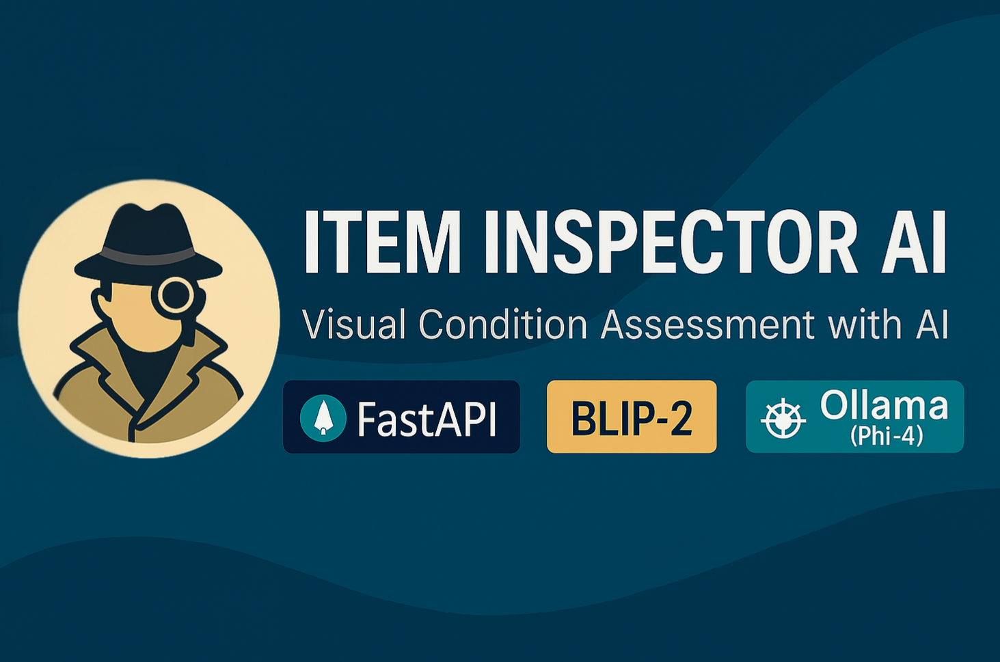

# 🕵️‍♂️ Item-Inspector AI


**Visual AI for Product Condition Assessment & Human-like Reporting**

> Upload product images, let BLIP-2 understand the item, generate human-like condition reports with Phi-4, and enjoy the magic of zero-shot image-to-text reasoning. Also… there's a secret mini-game.

## 📚 Table of Contents
- [Features](#-features)
- [Banner](#-banner)
- [Project Structure](#-project-structure)
- [Installation Guide](#-installation-guide)
- [Hardware & GPU Setup](#-hardware--gpu-setup)
- [Bonus: Tic-Tac-Toe AI](#-bonus-tic-tac-toe-ai)
- [Technology Stack](#-technology-stack)
- [GitHub Topics](#-github-topics)
- [License](#-license)
- [Contact](#-contact)

---

## ✨ Features

- **AI Product Recognition** – Detects object type: Watch, Shoe, Phone, etc.
- **Material Identification** – Metal, Leather, Glass, Suede? We got it.
- **Visual Condition Tags** – Custom per-item labels (like “scratched glass” or “torn strap”).
- **Score Calculation** – Evaluates product damage level and assigns a 4–10 score.
- **Natural Language Report** – Uses Phi-4 LLM to describe condition in ~50 human-like words.
- **Frontend Upload UI** – Drag, drop, analyze.

---

## 📸 Banner



---

## 🗂 Project Structure

```text
Item-Inspector AI/
├── backend/
│   ├── app.py               # This FastAPI file
│   ├── requirements.txt
│   ├── python_gpu_test.py   # Check if TensorFlow, pytorch & numpy runs on GPU
├── frontend/
│   └── index.html           # Web UI for uploading images
├── sample_images/
│   └── example_watch.jpg    # Example test image
├── just_for_fun/
│   └── tic_tac_toe.py       # Tic-Tac-Toe AI game
├── README.md
```
---

## 🛠 Installation Guide

### 🔗 Prerequisites

- Python 3.10+ (recommended Python 3.10.11 for GPU usage on windows)
- GitHub Desktop or Git CLI
- Ollama installed & phi4(phi4:14b-q4_K_M) model downloaded

---

### 📥 1. Clone the Repo

git clone https://github.com/Rooshikesh/Item-Inspector-AI.git
```text
cd Item-Inspector-AI/backend
```
---

### 📦 2. Create Virtual Environment
```text
python -m venv venv
source venv/bin/activate  # Windows: venv\Scripts\activate
```
---

### 📦 3. Install Dependencies

pip install -r requirements.txt

---

### 🧠 4. Start Ollama with Phi-4
```text
ollama run phi4:14b-q4_K_M
```
---

### 🚀 5. Launch FastAPI
```text
uvicorn app:app --reload
```
Go to: `http://127.0.0.1:8000/docs`

---

### 🌐 6. Use Web Interface (Optional)

Open frontend/index.html in your browser. Drag and drop product images.

---

## ⚡ Hardware & GPU Setup

If you're planning to run BLIP-2 on GPU for maximum performance, keep the following in mind:

### ✅ Hardware Requirements
- **NVIDIA GPU** with at least **8–12GB VRAM**
  - Recommended: **RTX 3060 or higher**
- **CUDA-compatible drivers** installed
  - Check GPU visibility with: `nvidia-smi`
- **Python**: Version **3.10+**

### ✅ Python Environment for GPU
- Install PyTorch with CUDA support:
  ```text
  pip install torch torchvision torchaudio --index-url https://download.pytorch.org/whl/cu121
  ```
- Our code already includes:
  ```text
  device = torch.device("cuda" if torch.cuda.is_available() else "cpu")
  torch_dtype=torch.float16
  ```
  This ensures your models run on GPU if available.

### ✅ BLIP-2 Optimization Settings
- Make sure BLIP-2 loads with:
  ```text
  device_map="auto", torch_dtype=torch.float16
  ```
- Images are correctly converted to RGB before inference:
  ```text
  img = Image.open(file.file).convert("RGB")
  ```
### 🧪 Verify GPU with Our Utility Script
Run the included [`python_gpu_test.py`](backend/python_gpu_test.py) file to confirm if TensorFlow, PyTorch, and NumPy are GPU-ready:
```text
cd backend
python python_gpu_test.py
```
This script will print the detected GPUs, framework versions, and whether each is using the GPU or CPU.

---

## 🤖 Bonus: Tic-Tac-Toe AI

When you need a break from debugging and BLIP-2 hallucinations:
```text
cd just_for_fun
python tic_tac_toe.py
```
* Supports easy, medium, and hard mode
* Uses Minimax algorithm in Hard mode to destroy your confidence 🔥

---

## 💡 Technology Stack

* BLIP-2 (Salesforce) - Vision Language
* Phi-4 (Ollama) - Language Generation
* FastAPI - Backend Framework
* HTML/JS - Minimal Frontend
* Hugging Face Transformers
* PyTorch

---

## 🏷️ GitHub Topics

ai, blip2, phi4, fastapi, transformers, computer-vision, image-classification,
product-inspection, natural-language-generation, multimodal-ai, semantic-analysis,
ecommerce-ai, repairtech, humanlike-ai, condition-scoring, pytorch, webapi,
backend, frontend, python

---

## 📄 License

MIT — use it, share it, modify it. Just don’t forget to smile when it works.

---

## ✉️ Contact

**Rooshikesh Bhatt**
rooshikeshbhatt@gmail.com

---
